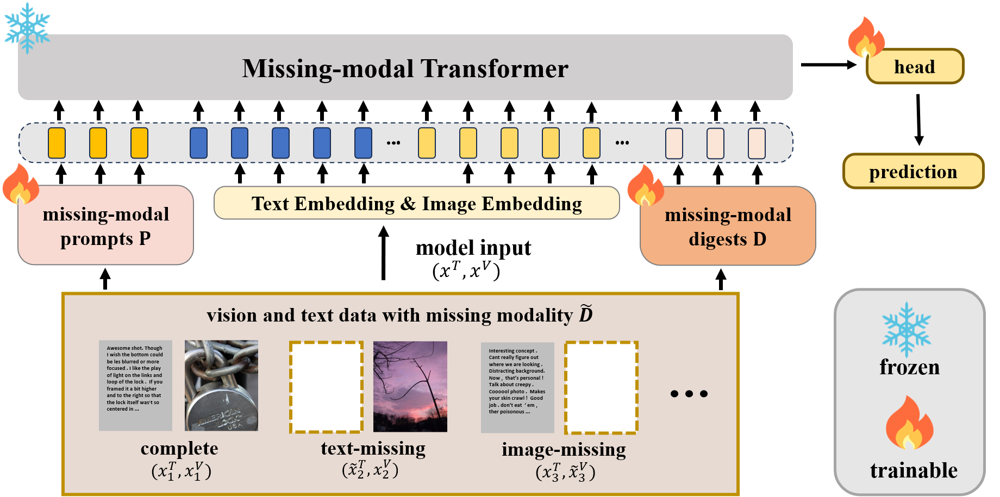

# MMAes: Missing Modality Aesthetic Assessment with Digest Mechanism

## Introduction
We design a new framework of multimodal networks based on Transformer, named MMAes, with a focus on missing modality aesthetic assessment. MMAes tackles a challenge in multimodal learning for aesthetic assessment when missing modality occurs either during training or testing in real-world situations. Our newly introduced digest mechanism enhances the interaction between complete and missing modality with reduced computational costs. We benefit missing-digests generated from missing-prompts and missing modality data. Each digest compresses the prompts and missing modality data, instructing model in learning and balancing the unequal status of complete and missing modality. MMAes achieves a SOTA performance in terms of complete modality and improves all metrics significantly compared to baseline model in case of missing modality. 

## Framework
<div align="center">
  
</div>

## Requirements
* pytorch_lightning==1.1.4
* torch==1.10.0+cu113
* transformers==4.29.0
* tqdm==4.56.0
* ipdb==0.13.4
* numpy==1.19.5
* sklearn==
* pyarrow==2.0.0
* sacred==0.8.2
* pandas==1.1.5
* torchmetrics==0.11.1
* jsonlines==3.0.0
* einops==0.3.0

## Download Dataset
* AVA-images: [link(pwd: fcun)](https://pan.baidu.com/s/1UkeGyTO6q_9iApBkmnT8Rg?pwd=fcun)
* AVA-comments: [link(pwd: b23f)](https://pan.baidu.com/s/1jMnpdqZCf3YRxBz9JBSNvw?pwd=b23f)
* Dataset structure as follow:
```
AVA
├── images            
│   ├── 53.jpg               
│   ├── 54.jpg
│   ├── 66.jpg
│   ├── 69.jpg
│   ├── 70.jpg
│   ├── 71.jpg
│   ├── 75.jpg
│   ├── 76.jpg
│   └── ...
├── texts          
│   ├── 53.txt               
│   ├── 54.txt
│   ├── 66.txt
│   ├── 69.txt
│   ├── 70.txt
│   ├── 71.txt
│   ├── 75.txt
│   ├── 76.txt
│   └── ...          
├── train.csv
├── val.csv
└── test.csv
```

## How to Run the Code
* The first step is converting the dataset into the form of `xxx.arrow`, where we use `pyarrow` to simplify data transmission and serialize the datasets. After your downloading the dataset, you should run the code `./makedata/make_arrow.py` to achive the goal. If you have your own dataset, you can make some changes to the code based on your requirements.
```
example:
python make_arrow.py --dataset [ava] --root [./datasets]

arrow folder structure as follow:
ava     
├── ava_train.arrow
├── ava_val.arrow
└── ava_test.arrow
```
* Before you officially start training the model, you need to download pre trained weight files according to your needs.
    * [ViLT-B/32 Pretrained with MLM+ITM for 200k steps on GCC+SBU+COCO+VG (ViLT-B/32 200k)](https://github.com/dandelin/ViLT/releases/download/200k/vilt_200k_mlm_itm.ckpt)
    * [ViLT-B/32 200k finetuned on VQAv2](https://github.com/dandelin/ViLT/releases/download/200k/vilt_vqa.ckpt)
    * [ViLT-B/32 200k finetuned on NLVR2](https://github.com/dandelin/ViLT/releases/download/200k/vilt_nlvr2.ckpt)
    * [ViLT-B/32 200k finetuned on COCO IR/TR](https://github.com/dandelin/ViLT/releases/download/200k/vilt_irtr_coco.ckpt)
    * [ViLT-B/32 200k finetuned on F30K IR/TR](https://github.com/dandelin/ViLT/releases/download/200k/vilt_irtr_f30k.ckpt)

* Now you can try to start to train and test your model 
```
example:
python run.py with load_path="pretrained/vilt_200k_mlm_itm.ckpt" visual=False test_only=False
```
## Acknowledgements
This code is based on [ViLT](https://github.com/dandelin/ViLT.git).